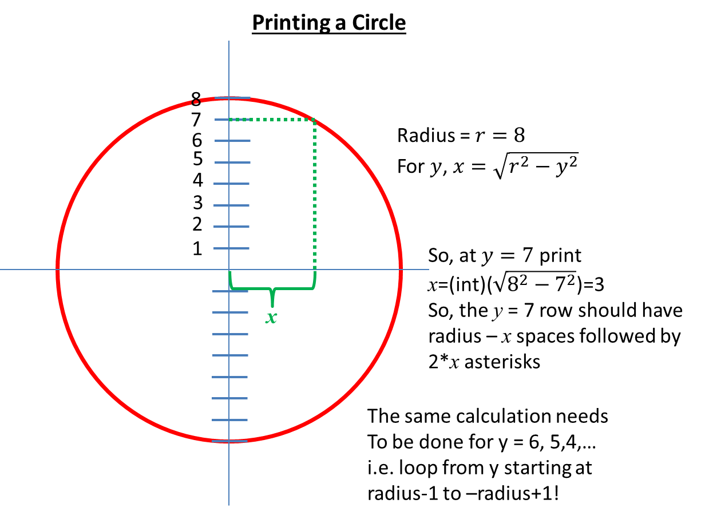

# Recitation 7 - Loopy Loops

This Skill Builder will require you to write several functions in which loops will be the focus.  In addition, 
some of these function will require you to design and implement finite state machines.  So, let's get started!

The class called Recitation7 with a set of skeleton methods provided.  The 
requirements for each method is provided below.

## Left Triangle

In the template below, SkillBuilder6 has a method with the following signature:
<p style="font-family: 'courier new', courier;background-color:#f5f5f5;padding:10px 10px 10px 10px;border:solid 1px #dddddd;color:blue;font-weight:bold;">
public static String leftRightTriangle(int height)
<p>
that returns a string consisting of asterisks in a left-right triangle pattern with a height, 
<span style="font-family: 'courier new', courier;font-weight:bold;">height</span>.  When the method is 
invoked as follows:

```java
Recitation7.leftRightTriangle(5);
```
the result is a string that is equivalent to the following:

```
*\n**\n***\n****\n*****\n
```

If printed,

```java
System.out.println(SkillBuilder6.leftRightTriangle(5));
```

The result is:

```
*
**
***
****
*****
```

Invoking the method with a different argument,

```java
SkillBuilder6.leftRightTriangle(3)
```

results in,

```
*\n**\n***\n
```

and if printed,

```
System.out.println(SkillBuilder6.leftRightTriangle(3));
```

results in,

```
*
**
***
```

## Right Triangle

In the template below, skillBuilder7 has a method with the following signature:
<p style="font-family: 'courier new', courier;background-color:#f5f5f5;padding:10px 10px 10px 10px;border:solid 1px #dddddd;color:blue;font-weight:bold;">
public static String rightRightTriangle(int height)
<p>
that returns a string consisting of asterisks in a right-right triangle pattern with a height, <span style="font-family: 'courier new', courier;font-weight:bold;">height</span>.  When the method is invoked as follows:

```java
skillBuilder7.rightRightTriangle(5);
```

the result is a string that is equivalent to the following:

```
    *\n   **\n  ***\n ****\n*****\n
```

If printed,

```java
System.out.println(recitation7.rightRightTriangle(5));
```

The result is:

```
    *
   **
  ***
 ****
*****
```

Invoking the method with a different argument,

```java
recitation7.rightRightTriangle(3)
```

results in,

```
  *\n **\n***\n
```

and if printed,

```java
System.out.println(recitation7.rightRightTriangle(3));
```

results in

```
  *
 **
***
```
## Let's Draw a Circle - Yay!

The template below has a static method with the following signature:
<p style="font-family: 'courier new', courier;background-color:#f5f5f5;padding:10px 10px 10px 10px;border:solid 1px #dddddd;color:blue;font-weight:bold;">
public static String circle(int radius)
<p>
That returns a string of asterisks representing a circle pattern with a radius, <span style="font-family: 'courier new', courier;font-weight:bold;">radius</span>.  When the method is invoked as follows:

```java
recitation7.circle(5)
```

the result is a string as follows,

```
  ******\n ********\n ********\n ********\n**********\n ********\n ********\n ********\n  ******
```

If printed,

```java
System.out.println(recitation7.circle(5))
```

the result is,
<pre style="font-family: 'courier new', courier;background-color:#f5f5f5;padding:5px 10px 5px 0px;border:solid 1px #dddddd;">
  ******
 ********
 ********
 ********
**********
 ********
 ********
 ********
  ******
</pre>
Invoking the method with a different argument, 

```java
recitation7.circle(8)
```

the result is a string as follows,

```
"     ******\n   **********\n  ************\n  ************\n **************\n **************\n **************\n****************\n **************\n **************\n **************\n  ************\n  ************\n   **********\n     ******\n"
```

If printed,

```java
System.out.println(recitation7.circle(8))
```
the result is,
<pre style="font-family: 'courier new', courier;background-color:#f5f5f5;padding:5px 10px 5px 0px;border:solid 1px #dddddd;">
     ******
   **********
  ************
  ************
 **************
 **************
 **************
****************
 **************
 **************
 **************
  ************
  ************
   **********
     ******
</pre>
An explanation of how to calculate the number of asterisks to print on each line is provided in the illustration below.



Note that you do not need to calculate <span style="font-family: 'times new roman', times;font-weight:bold;font-style:italic;">x</span> for <span style="font-family: 'times new roman', times;font-weight:bold;font-style:italic;">y = r</span> or for <span style="font-family: 'times new roman', times;font-weight:bold;font-style:italic;">y = -r</span> since for both these values, <span style="font-family: 'times new roman', times;font-weight:bold;font-style:italic;">x = 0</span>.  So, you can use a for-loop that goes from <span style="font-family: 'courier new', courier;font-weight:bold;">radius-1 to -radius+1, inclusively or radius-1 to -radius, exclusively of -radius</span>.
